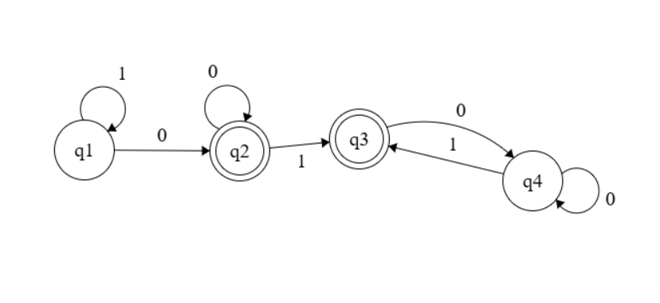

# TPC1
Autor: João Oliveira, a108647 

Resumo: Expressão regular de strings binárias que não incluem a subsequência "011"

Lista de resultados: 

    Resposta:1*(0+(1)?0*)* 
    Utilizei um automato, para ajuda, na construção da resposta

